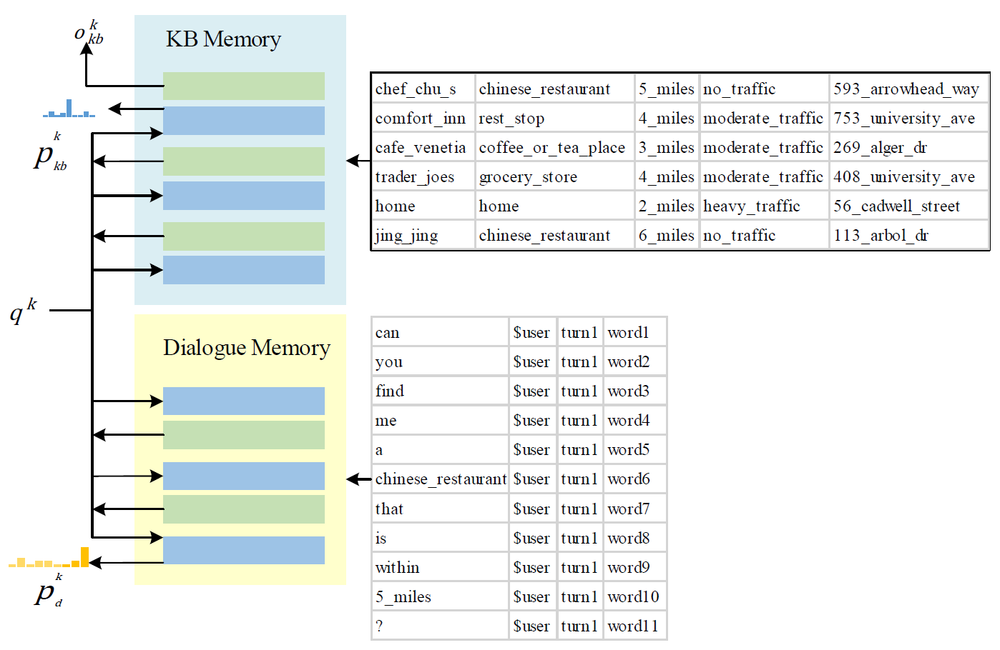

## A Hierarchical Memory Model for Task-Oriented Dialogue System 

This is the PyTorch implementation of the paper:
**A Hierarchical Memory Model for Task-Oriented Dialogue System**. [**Ya Zeng**], [Li Wan], [Qiuhong Luo] [Mao Chen]. 

This code has been written using PyTorch == 1.6.0. 

## Abstract
Traditional pipeline methods for task-oriented dialogue systems are designed individually and expensively. Existing memory augmented end-to-end methods directly map the inputs to outputs and achieve promising results. However, the most existing end-to-end solutions store the dialogue history and knowledge base (KB) information in the same memory and represent KB information in the form of KB triples, making the memory reader's reasoning on the memory more difficult, which makes the system difficult to retrieve the correct information from the memory to generate a response. Some methods introduce many manual annotations to strengthen reasoning. To strengthen reasoning, while reducing the use of manual annotations, we propose a hierarchical memory model (HM2Seq) for task-oriented systems. HM2Seq uses a hierarchical memory to separate the dialogue history and KB information into two memories and stores KB in KB rows, then we use memory rows pointer combined with an entity decoder to perform hierarchical reasoning over memory. The experimental results on two publicly available task-oriented dialogue datasets confirm our hypothesis and show the outstanding performance of our HM2Seq by outperforming the baselines.


## Train a model for task-oriented dialog datasets
We created `myTrain.py` to train models. You can run:
HM2Seq navigate domain of KVR dialogue:
```console
❱❱❱ python myTrain.py -lr=0.001 -l=3 -hdd=128 -dr=0.2 -bsz=8 -ds=kvr_navigate 
```
or HM2Seq schedule domain of KVR dialogue:
```console
❱❱❱ python myTrain.py -lr=0.001 -l=3 -hdd=128 -dr=0.2 -bsz=8 -ds=kvr_schedule 
```
or HM2Seq weather domain of KVR dialogue:
```console
❱❱❱ python myTrain.py -lr=0.001 -l=3 -hdd=128 -dr=0.2 -bsz=8 -ds=kvr_weather 
```
or HM2Seq Camrest dialogue:
```console
❱❱❱ python myTrain.py -lr=0.001 -l=3 -hdd=128 -dr=0.2 -bsz=8 -ds=camrest
```

While training, the model with the best validation is saved. If you want to reuse a model add `-path=path_name_model` to the function call. The model is evaluated by using per responce accuracy, WER, F1 and BLEU.

## Test a model for task-oriented dialog datasets
We created  `myTest.py` to train models. You can run:
HM2Seq navigate domain of KVR dialogue:
```console
❱❱❱ python myTest.py -ds=kvr_navigate -path=<path_to_saved_model> 
```
or HM2Seq Camrest dialogue 
```console
❱❱❱ python myTest.py -ds=camrest -path=<path_to_saved_model> -rec=1
```


## Architecture
<p align="center">

</p>

<p align="center">

</p>

## Acknowledgement

**Global-to-local Memory Pointer Networks for Task-Oriented Dialogue**. [Chien-Sheng Wu](https://jasonwu0731.github.io/), [Richard Socher](https://www.socher.org/), [Caiming Xiong](http://www.stat.ucla.edu/~caiming/). ***ICLR 2019***. [[PDF]](https://arxiv.org/abs/1901.04713) [[Open Reivew]](https://openreview.net/forum?id=ryxnHhRqFm) [[Code]](https://github.com/jasonwu0731/GLMP)

>   We are highly grateful for the public code of GLMP!
